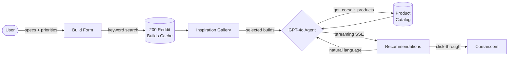

# Corsair Build Advisor

## The Problem

PC builders know what parts they have, their requirements and constraints, but not what to buy next. Corsair's product catalogue has 200+ SKUs across cases, cooling, RAM, fans, peripherals but no easy way to answer "what should I actually get for my build?". Once you have a build, upsell decisions are primarily made based on community clout, but this isn't available on the corsair website.

The result: High browse-to-purchase drop-off and missed upsell opportunities across the Corsair ecosystem.

---

## The Solution

A 3-step advisor that turns aesthetic preference into a personalized Corsair shopping list:

1. **Specs in** — CPU, GPU, budget, priorities (visual / performance / value)
2. **Inspiration gallery** — real r/Corsair community builds; user picks what resonates
3. **AI recommendations** — GPT-4o uses the selected builds as taste signal to pick Corsair products within budget, with a natural language refinement loop

The key insight: the build selection step captures taste that sliders can't — "I want *this* vibe" — making recommendations feel personal, not algorithmic.

---

## Flow



---

## Success Metrics

| Metric | What it measures |
|---|---|
| **Discovery → Gallery → Recommendations rate** | Are users engaged enough to select builds and continue? |
| **Builds selected per session** | Depth of inspiration exploration (target: 2–4) |
| **Refinement loops per session** | Conversational engagement; higher = stronger product-market fit signal |
| **Budget accuracy** | `|recommended_total - budget| / budget` — lower is better |
| **Corsair.com click-through rate** | Intent to purchase from the recommendation cards |
| **Ecosystem breadth** | Avg # of distinct Corsair categories per recommendation set |

---

## Stack

- **Backend:** FastAPI + GPT-4o (function calling)
- **Frontend:** React + Vite + Tailwind CSS
- **Data:** 200 pre-cached r/Corsair community builds, 30+ Corsair products

---

## Setup

**1. Install dependencies**
```bash
python -m venv .venv && source .venv/bin/activate
pip install -r backend/requirements.txt

cd frontend && npm install && cd ..
```

**2. Add your OpenAI key**
```bash
echo "OPENAI_API_KEY=sk-..." > .env
```

**3. Run**
```bash
# Terminal 1 — backend
source .venv/bin/activate
uvicorn backend.main:app --reload --port 8000

# Terminal 2 — frontend (dev)
cd frontend && npm run dev
```

Open [localhost:5173](http://localhost:5173).

---

## Deployment (Render)

Connect the GitHub repo on [render.com](https://render.com) — it auto-detects `render.yaml`. Add `OPENAI_API_KEY` in the Render environment tab.

---

## Refresh the Reddit cache

```bash
source .venv/bin/activate
python -m backend.utils.fetch_builds_cache
```
